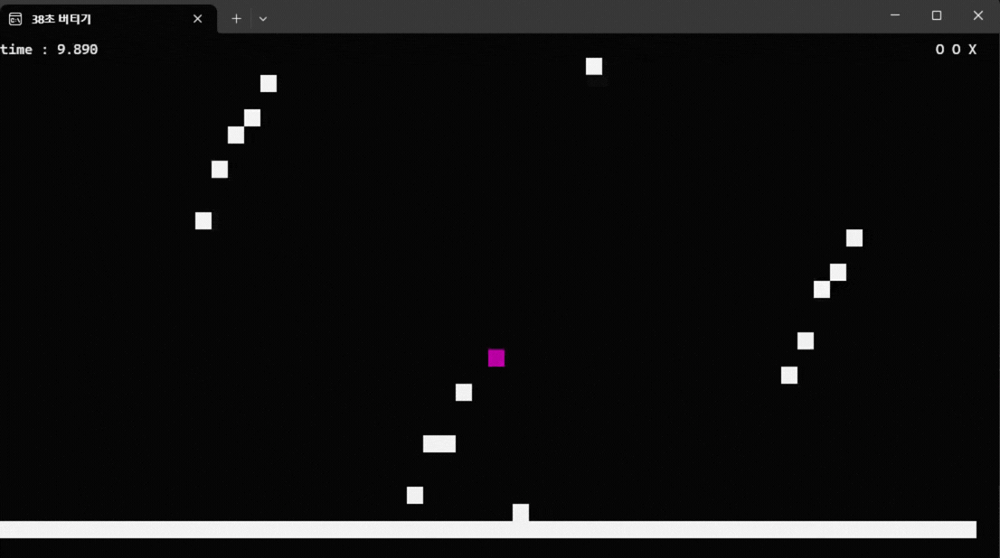

# Survive38s

Windows 콘솔 환경에서 제작한 2D 생존 게임입니다.  
플레이어는 제한 시간인 38초 동안 장애물을 피하며 생존해야 하며, 생명력이 모두 소진되면 게임 오버가 됩니다.

본 프로젝트는 게임인재원 5기 콘솔 프로젝트로 제작한 개인 프로젝트입니다.  
콘솔 화면 출력, 입력 처리, 씬 전환, 충돌 판정, 시간 기반 업데이트, 사운드 재생 등 게임 루프의 기본 구조를 직접 구현하는 데 초점을 두었습니다.

## 실행 화면

[](https://www.youtube.com/watch?v=rt1473CPnTo)

> 위 이미지를 클릭하면 플레이 영상을 확인할 수 있습니다.

## 주요 기능

* **38초 생존 목표**

  * 플레이어는 장애물을 피하면서 38초 동안 생존해야 합니다.
  * 제한 시간이 지나면 클리어 화면으로 전환됩니다.

* **플레이어 조작**

  * 방향키로 좌우 이동할 수 있습니다.
  * 스페이스바로 점프할 수 있습니다.
  * 2단 점프를 지원하여 공중에서도 한 번 더 점프할 수 있습니다.

* **장애물 회피**

  * 장애물은 지정된 시간에 생성됩니다.
  * 각 장애물은 위치, 방향, 크기 정보를 기반으로 이동합니다.
  * 플레이어가 장애물과 충돌하면 생명이 감소합니다.

* **생명 시스템**

  * 플레이어는 총 3개의 생명을 가지고 시작합니다.
  * 충돌 시 생명이 1 감소합니다.
  * 생명이 모두 사라지면 게임 오버 화면으로 전환됩니다.

* **충돌 후 무적 시간**

  * 충돌 직후 일정 시간 동안 추가 충돌을 방지합니다.
  * 무적 시간 동안 플레이어 색상이 깜빡이며 상태를 시각적으로 표시합니다.

* **씬 전환**

  * 타이틀, 게임, 조작법, 크레딧, 종료, 클리어, 게임 오버 화면으로 구성되어 있습니다.
  * 각 씬은 독립적인 초기화, 업데이트, 종료 함수를 통해 관리됩니다.

* **콘솔 사운드 재생**

  * Windows 사운드 API를 사용하여 BGM을 재생합니다.
  * 타이틀/메뉴 BGM과 게임 BGM을 구분하여 재생합니다.

## 구현 상세

### 게임 루프 구조

프로그램은 `Initialize()`, `Loop()`, `Finalize()` 흐름으로 실행됩니다.

* `Initialize()`
  입력, 시간, 렌더링, 사운드, 씬 시스템을 초기화합니다.

* `Loop()`
  프로그램이 종료되기 전까지 매 프레임 입력, 시간, 사운드, 렌더링, 씬 업데이트를 반복합니다.

* `Finalize()`
  실행 중 사용한 시스템을 정리합니다.

이 구조를 통해 게임의 전체 실행 흐름을 프레임 단위로 관리합니다.

### 씬 관리 시스템

씬은 enum 값과 함수 포인터 배열을 이용해 관리됩니다.
각 씬은 다음과 같은 함수 구조를 가집니다.

* `Init`
* `Update`
* `Final`

현재 씬이 변경되면 기존 씬의 종료 함수를 호출한 뒤, 새 씬의 초기화 함수를 호출합니다.
이를 통해 타이틀, 게임, 클리어, 게임 오버 등의 화면을 분리하여 관리할 수 있도록 구성했습니다.

### 플레이어 시스템

플레이어는 위치, 색상, 생명, 점프 상태, 속도 값을 가지고 동작합니다.

* 좌우 방향키 입력으로 x축 이동
* 스페이스바 입력으로 점프
* 중력 값을 이용한 y축 이동
* 최대 2단 점프 지원
* 화면 밖으로 나가지 않도록 이동 범위 제한
* 충돌 시 생명 감소 및 무적 시간 처리

플레이어의 위치는 충돌 판정과 렌더링에 사용됩니다.

### 장애물 시스템

장애물은 텍스트 리소스에서 읽어온 데이터를 기반으로 생성됩니다.
각 장애물은 다음 정보를 가집니다.

* 생성 시간
* 시작 위치
* 이동 방향
* 크기
* 생성 여부
* 소멸 여부

게임 시간이 장애물의 생성 시간에 도달하면 해당 장애물이 활성화됩니다.
활성화된 장애물은 방향 벡터를 기준으로 이동하며, 화면 밖으로 나가면 소멸 처리됩니다.

### 충돌 판정

충돌 판정은 플레이어 위치가 장애물의 사각형 영역 안에 들어왔는지를 검사하는 방식으로 구현했습니다.

장애물이 생성되어 있고 아직 소멸되지 않은 상태일 때만 충돌 검사를 수행합니다.
충돌이 발생하면 플레이어의 `IsCrash()` 함수를 호출하여 생명 감소와 무적 시간을 처리합니다.

### 고정 업데이트

게임 내부 로직은 `fixedUpdateTime` 값을 기준으로 일정한 주기마다 업데이트됩니다.

* 플레이어 물리 처리
* 장애물 이동
* 충돌 판정

위 로직은 고정 업데이트에서 처리하고, 화면 출력과 UI 갱신은 매 프레임 처리합니다.
이를 통해 프레임마다 달라질 수 있는 렌더링 주기와 게임 로직 갱신 주기를 분리했습니다.

### 콘솔 렌더링

Windows Console API를 사용하여 콘솔 화면을 직접 제어합니다.

구현된 렌더링 기능은 다음과 같습니다.

* 콘솔 창 크기 설정
* 콘솔 버퍼 크기 설정
* 커서 숨김 처리
* 창 크기 고정
* 콘솔 제목 설정
* 더블 버퍼링 구현
* 문자와 배경색을 이용한 화면 출력

더블 버퍼링을 사용하여 콘솔 화면을 번갈아 출력함으로써 깜빡임을 줄였습니다.

### 입력 처리

입력은 `GetAsyncKeyState()`를 사용해 처리합니다.

지원하는 키는 다음과 같습니다.

* 왼쪽 방향키
* 오른쪽 방향키
* 스페이스바

각 키는 `DOWN`, `TAP` 상태로 구분됩니다.

* `DOWN`: 키를 누르고 있는 상태
* `TAP`: 키를 누른 첫 프레임

이를 통해 이동처럼 지속 입력이 필요한 기능과 점프처럼 순간 입력이 필요한 기능을 분리했습니다.

### 시간 관리

시간 관리는 `GetTickCount64()`를 사용해 구현했습니다.

이전 프레임 시간과 현재 프레임 시간의 차이를 계산하여 `DeltaTime`을 구하고, 이를 플레이 시간, 고정 업데이트 타이머, 무적 시간 처리 등에 사용합니다.

### 사운드 시스템

Windows 멀티미디어 API를 사용하여 `.wav` 파일을 재생합니다.

* `PlaySound()`를 이용한 비동기 반복 재생
* `waveOutSetVolume()`을 이용한 볼륨 설정
* 씬 전환 시 BGM 정지 및 변경

## 기술 스택

| 항목           | 내용                          |
| ------------ | --------------------------- |
| Language     | C++                         |
| Platform     | Windows                     |
| IDE          | Visual Studio               |
| Rendering    | Windows Console API         |
| Input        | GetAsyncKeyState            |
| Sound        | Windows 멀티미디어 API 기반 사운드 재생 |
| Project Type | Console Game                |

## 프로젝트 구조

```text
Survive38s/
├─ README.md
├─ Survive38s.sln
└─ Survive38s/
   ├─ Survive38s.cpp        # main 함수, 전체 실행 진입점
   ├─ Framework.h / .cpp    # 초기화, 메인 루프, 종료 처리
   ├─ Scene.h / .cpp        # 씬 전환 및 씬 함수 관리
   ├─ Game.h / .cpp         # 인게임 진행, 플레이 시간, UI, 클리어 처리
   ├─ Player.h / .cpp       # 플레이어 이동, 점프, 생명, 충돌 처리
   ├─ Obstacle.h / .cpp     # 장애물 생성, 이동, 소멸, 렌더링
   ├─ Collision.h / .cpp    # 플레이어와 장애물 충돌 판정
   ├─ Render.h / .cpp       # 콘솔 출력, 더블 버퍼링, 색상 처리
   ├─ Input.h / .cpp        # 키 입력 상태 관리
   ├─ Time.h / .cpp         # DeltaTime 계산
   ├─ Sound.h / .cpp        # BGM 재생 및 정지
   ├─ Resource.h / .cpp     # 텍스트 리소스 로드
   ├─ Util.h / .cpp         # 좌표 변환, 값 제한 등 유틸리티
   ├─ Title.h / .cpp        # 타이틀 씬
   ├─ Ctrl.h / .cpp         # 조작법 씬
   ├─ Credit.h / .cpp       # 크레딧 씬
   ├─ Clear.h / .cpp        # 클리어 씬
   ├─ Over.h / .cpp         # 게임 오버 씬
   └─ Quit.h / .cpp         # 종료 씬
```

## 리소스 출처

현재 리포지토리 코드에서는 다음 리소스를 사용합니다.

```text
./Resource/BGM.wav
./Resource/gameBGM.wav
./Resource/obstacles.txt
```

* [`BGM.wav`](https://www.youtube.com/watch?v=yUHkIKNh7M4): 메뉴/기본 화면 BGM
* [`gameBGM.wav`](https://www.youtube.com/watch?v=rbUjSQPblBs): 인게임 BGM
* `obstacles.txt`: 직접 작성한 장애물 생성 데이터
